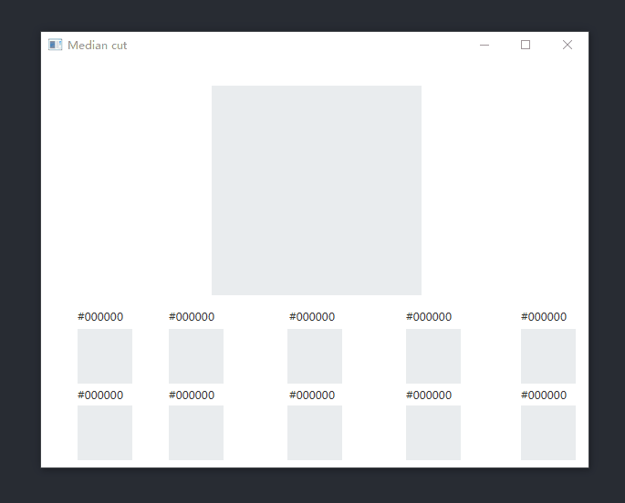

# Java-Median-Cut
<a name="readme-top"></a>


<!-- PROJECT LOGO -->
<br />
<div align="center">

<h3 align="center">Median Cut Algorithm</h3>

  <p align="center">
    Implementation of Median Cut Algorithm in java
    <br />
  </p>
</div>


<!-- ABOUT THE PROJECT -->
## About The Project

<p align="center">
  
    <br />


Median cut is an algorithm to sort data of an arbitrary number of dimensions into series of sets by recursively cutting each set of data at the median point along the longest dimension (Wiki).

<p align="right">(<a href="#readme-top">back to top</a>)</p>

### Prerequisites

The algorithm is completed by Java without any dependence.

<p align="right">(<a href="#readme-top">back to top</a>)</p>


### Installation

_Below is an example of how you can instruct your audience on installing and setting up your app. This template doesn't rely on any external dependencies or services._

1. Clone the repo
   ```sh
   git clone https://github.com/yuenci/Java-Median-Cut
   ```
3. Open with [IntelliJ IDEA ](https://www.jetbrains.com/idea/)

<p align="right">(<a href="#readme-top">back to top</a>)</p>


<!-- CONTRIBUTING -->
## Contributing


If you have a suggestion that would make this better, please fork the repo and create a pull request. You can also simply open an issue with the tag "enhancement".
Don't forget to give the project a star! Thanks again!

1. Fork the Project
2. Create your Feature Branch (`git checkout -b feature/AmazingFeature`)
3. Commit your Changes (`git commit -m 'Add some AmazingFeature'`)
4. Push to the Branch (`git push origin feature/AmazingFeature`)
5. Open a Pull Request

<p align="right">(<a href="#readme-top">back to top</a>)</p>

## Authors
<a href="https://github.com/yuenci" target="_blank" >
  
</a>


<!-- CONTACT -->
## Contact

Innis - yuenci1575270674@gmail.com

<p align="right">(<a href="#readme-top">back to top</a>)</p>


<!-- LICENSE -->
## License

Distributed under the MIT License. See [LICENSE](./LICENSE) for more information.

<p align="right">(<a href="#readme-top">back to top</a>)</p>


<!-- ACKNOWLEDGMENTS -->
## Acknowledgments

* [Extracting a color palette from an image with javascript](https://dev.to/producthackers/creating-a-color-palette-with-javascript-44ip)

* [color-palette-extraction](https://github.com/zygisS22/color-palette-extraction)
